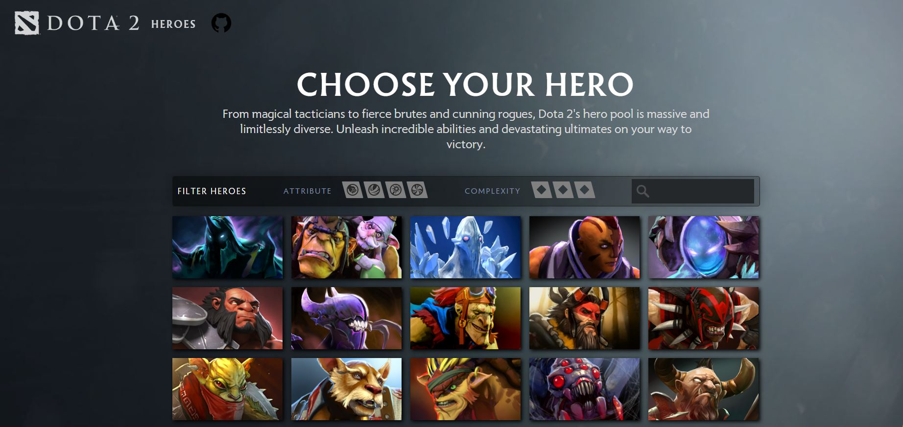
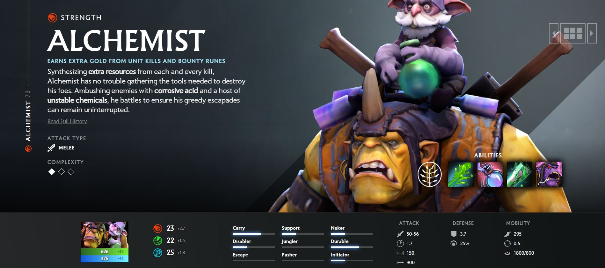
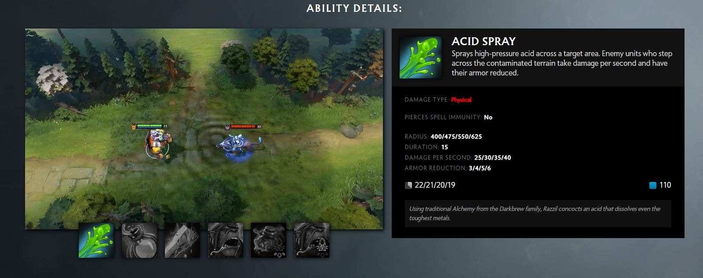
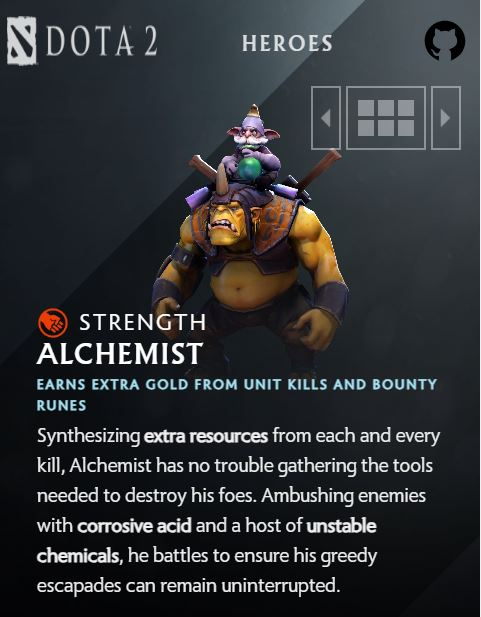

# Dota 2 React + Vite

<p align="center" style="display: flex; justify-content: space-between;"> 
   
    
  
  
</p>

<p align="center">
  <a href="#rocket-technologies">Technologies</a>&nbsp;&nbsp;&nbsp;|&nbsp;&nbsp;
  <a href="#information_source-how-to-use">How To Use</a>&nbsp;&nbsp;&nbsp;|&nbsp;&nbsp;
  <a href="#eyes-website">Original page</a>&nbsp;&nbsp;&nbsp;|&nbsp;
  &nbsp;
  <a href="#hammer-structure">Structure</a>&nbsp;&nbsp;&nbsp;|&nbsp;
  &nbsp;
  <a href="#arrow_right_hook-Hooks">Hooks</a>&nbsp;&nbsp;&nbsp;|&nbsp;
  &nbsp;
  <a href="#pushpin-scripts">Scripts</a>&nbsp;&nbsp;&nbsp;|&nbsp;
   &nbsp;
  <a href="https://dota-2-project.vercel.app/">Preview</a>
</p>








## :rocket: Technologies

This project was developed using the following technologies:

- [React.js](https://react.dev/)
- [TanStack Query V5](https://tanstack.com/query/latest/docs/framework/react/overview)
- [react router](https://reactrouter.com/en/main)
- [vite](https://vitejs.dev/)
- [Css modules](https://github.com/css-modules/css-modules)
- [scss/sass](https://sass-lang.com/)
- [Stylelint](https://stylelint.io/)
- [vite-plugin-image-optimizer](https://github.com/FatehAK/vite-plugin-image-optimizer)
- [eslint-plugin-react](eslint-plugin-react)

  ## :information_source: How To Use

To clone and run this application. From your command line:

```bash
# Clone this repository
$ git clone https://github.com/SergeyLif/dota-2-project

# Go into the repository
$ cd dota2

# Install dependencies
$ npm install

# Install a husky
$ npm run prepare


# Run the app
$ npm run dev
```

## :arrow_right_hook: Hooks

Make some change in the files

```bash
$ git add . # add all the changes made

$ git commit -m "new changes" # create commit

# then there is a check with a linter and a styleLint. If no errors are found, run a post-commit which will push the changes to github

# if you want to send a commit without any checks use --no-verify
$ git commit -m "keep calm and commit" --no-verify

```

## :pushpin: Scripts

```bash

$ npm run build # starting application build

$ npm run preview # preview application

$ npm run lint # lint check runs

$ npm run lint:scss # check scss 

$ npm run dev # start an application in development mode 

```


## :hammer: Structure

```bash

├───dist
│   └───assets
├───node_modules
├───public
│   └───assets
├───screenshots
└───src
    ├───components
    │   ├───BackgroundPage
    │   ├───CollectionHeroes
    │   ├───Footer
    │   ├───Header
    │   ├───HeroDetailInfo
    │   │   ├───HeroAbilities
    │   │   ├───HeroAbilityDetails
    │   │   │   ├───HeroAbilityDetailsDamageType
    │   │   │   └───HeroAbilityDetails_GetAbilityDetails
    │   │   ├───HeroAttrsRoslStat
    │   │   ├───HeroDescription
    │   │   │   └───HeroDescriptionBioOrHype
    │   │   ├───HeroNavigator
    │   │   ├───HeroSwitch
    │   │   └───HeroTreeOfTalents
    │   ├───HeroeItem
    │   ├───HeroeList
    │   └───SearchCards
    ├───fonts
    ├───img
    ├───layouts
    │   └───MainLayout
    ├───pages
    │   ├───HeroesFilterPage
    │   └───HeroPage
    ├───query
    ├───shared
    │   ├───api
    │   ├───config
    │   └───utils
    └───styles

```

## :eyes: Original page

[Dota 2 website](https://www.dota2.com/heroes)

---